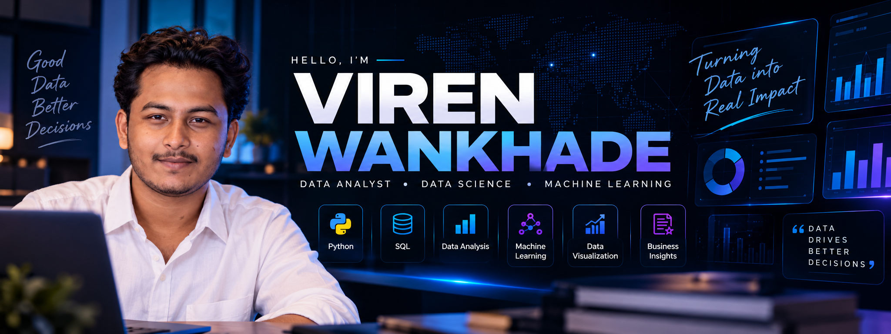

<!-- ========================================================= -->
<!--                    VIREN WANKHADE                        -->
<!--              GitHub Profile README                       -->
<!-- ========================================================= -->

  

  <a href="#about-me">About Me</a> •
  <a href="#currently-focused-on">Focus</a> •
  <a href="#technical-skills">Skills</a> •
  <a href="#my-analytics-workflow">Workflow</a> •
  <a href="#featured-projects">Projects</a> •
  <a href="#achievements--experience">Achievements</a> •
  <a href="#career-target">Career</a> •
  <a href="#connect-with-me">Contact</a>

  
  
  

 

  

 

---

## 👋 About Me

Hi, I'm **Viren Wankhade**, a **BCA graduate** focused on building a career in **Data Analytics and Data Science**.

I enjoy working with data to discover patterns, create meaningful visualizations, and build practical machine learning solutions. My work combines **Python, SQL, statistics, data visualization, and machine learning** to turn raw data into useful insights.

I'm currently strengthening my analytical and technical skills while actively looking for opportunities where I can contribute, learn, and grow as a **Data Analyst / Data Scientist**.

---

## 🎯 Currently Focused On

<table>
<tr>
<td width="50%">

### 📊 Data Analytics
- SQL & advanced querying
- Data cleaning & preprocessing
- Exploratory Data Analysis
- Business insights
- Data visualization
- Statistical analysis

</td>

<td width="50%">

### 🤖 Data Science
- Machine Learning
- Feature engineering
- Model evaluation
- Classification & regression
- Predictive analytics
- End-to-end ML projects

</td>
</tr>
</table>

 

> **Current priority:** Strengthening SQL, Python, analytics, machine learning and interview skills while preparing for a full-time Data/Analytics role.

---

# 🧠 Technical Skills

## 🐍 Programming & Data

## 📈 Analytics & Visualization

## 🤖 Machine Learning

## 🛠️ Tools & Technologies

---

# 📈 My Analytics Workflow

                 ┌──────────────────┐
                 │    RAW DATA      │
                 └────────┬─────────┘
                          ↓
                 ┌──────────────────┐
                 │ DATA CLEANING    │
                 │ & PREPROCESSING  │
                 └────────┬─────────┘
                          ↓
                 ┌──────────────────┐
                 │ EXPLORATORY      │
                 │ DATA ANALYSIS    │
                 └────────┬─────────┘
                          ↓
                 ┌──────────────────┐
                 │ VISUALIZATION    │
                 │ & STATISTICS     │
                 └────────┬─────────┘
                          ↓
                 ┌──────────────────┐
                 │ FEATURE          │
                 │ ENGINEERING      │
                 └────────┬─────────┘
                          ↓
                 ┌──────────────────┐
                 │ MACHINE          │
                 │ LEARNING         │
                 └────────┬─────────┘
                          ↓
                 ┌──────────────────┐
                 │ BUSINESS         │
                 │ INSIGHTS         │
                 └──────────────────┘

          DATA → ANALYSIS → INSIGHTS → DECISIONS

  

  
## 🧩 Featured Projects

## 🤖 Customer Churn Prediction
Machine Learning • Feature Engineering • Classification
Built a customer churn prediction system using real-world style customer data.
What I worked on
- Data preprocessing
- One-hot encoding
- Feature engineering
- Handling categorical variables
- Feature scaling
- Model training
- Model evaluation
- ROC-AUC analysis
Models
Logistic Regression
Decision Tree
Random Forest

Best Model Performance
Metric	Result
Accuracy	97%
Precision	78.57%
Recall	100%
F1 Score	88%
ROC-AUC	99.79%

## 🔗 Repository:

https://github.com/viren689/Week10-Customer-Churn-Prediction

## 🏠 House Price Prediction

Machine Learning • Regression • Data Preprocessing
Developed a machine learning model to predict house prices using property-related features.
Key concepts
- Data preprocessing
- Exploratory analysis
- Feature preparation
- Regression modelling
- Model evaluation
- Prediction analysis
## 🔗 Explore more projects:
https://github.com/viren689?tab=repositories
🛒 Black Friday Data Analysis
Python • Pandas • EDA • Data Visualization
Analyzed Black Friday purchasing data to understand customer purchasing behavior and identify useful business patterns.
Focus areas
- Customer demographics
- Purchase behaviour
- Product categories
- Spending patterns
- Data cleaning
- Exploratory analysis
- Visualization
## 🔗 GitHub Projects:
https://github.com/viren689?tab=repositories
🧠 DataForge AI
AI • Data Analysis • Web Application
A data-focused AI project designed to make working with data more accessible through an interactive experience.
Focus
- Data exploration
- AI-assisted workflows
- Data-driven insights
- Modern web interface
- Practical analytics experience

## 🌐 Portfolio:

https://viren-portfolio-gamma.vercel.app/

## 📊 Sales & E-Commerce Analytics
Python • Pandas • Seaborn • Business Analytics
Worked on multiple analytics projects involving sales and e-commerce datasets.
Covered
- Sales trends
- Customer analysis
- Product performance
- Revenue patterns
- Data manipulation
- Statistical analysis
- Interactive visualizations

## 🔗 View all repositories:

https://github.com/viren689?tab=repositories

## 🏆 Achievements & Experience
🎓 Bachelor of Computer Applications — BCA
Built a foundation in:
- Programming
- Database concepts
- Data structures
- Software development
- Computer applications

## 💼 Data Science / Analytics Internship Experience
Worked through practical projects covering the complete data workflow:
Python Fundamentals
        ↓
Data Analysis
        ↓
Data Visualization
        ↓
Pandas & Data Manipulation
        ↓
Statistics
        ↓
Business Analysis
        ↓
Machine Learning
        ↓
Customer Churn Prediction

This hands-on project experience helped me build practical skills beyond theoretical learning.

## 📚 Project-Based Learning

Completed projects across:
Python → SQL → Pandas → Visualization → Statistics → Machine Learning
with a strong focus on applying concepts to practical datasets.
💼 Career Target
I'm currently looking for opportunities in:

## 🎯 My goal
Start my professional career in a data-driven organization where I can use analytics and machine learning to solve real-world problems while continuously improving my technical and business skills.

# 📊 Data Analytics Profile

  
  
  
  

<table align="center">
<tr>
<td align="center" width="25%">

### 🐍
**Python**

Data Analysis  
Data Cleaning  
Feature Engineering

</td>

<td align="center" width="25%">

### 🗄️
**SQL**

Data Retrieval  
Filtering  
Aggregation  
Analysis

</td>

<td align="center" width="25%">

### 📊
**Analytics**

EDA  
Statistics  
Visualization  
Business Insights

</td>

<td align="center" width="25%">

### 🤖
**Machine Learning**

Regression  
Classification  
Model Evaluation

</td>
</tr>
</table>

 

### 🔬 Practical Experience

| Area | Applied In |
|---|---|
| 🐍 **Python & Pandas** | Sales Analysis • Customer Analysis • Churn Prediction |
| 📊 **Data Visualization** | Seaborn • Matplotlib • Plotly • Business Dashboards |
| 📈 **Statistics** | Statistical Business Analysis • Data Interpretation |
| 🤖 **Machine Learning** | House Price Prediction • Customer Churn Prediction |
| 🧩 **Feature Engineering** | Customer Churn Prediction |
| 🗄️ **SQL** | Currently strengthening advanced SQL & analytical querying |

 

### 🏆 Selected Project Results

| Project | Result |
|---|---|
| 🤖 Customer Churn Prediction | **97% Accuracy • 99.79% ROC-AUC** |
| 🌳 Random Forest | **100% Recall • 88% F1 Score** |
| 📈 Logistic Regression | **100% Recall • 88% F1 Score** |
| 🏠 House Price Prediction | End-to-end regression project |
| 🛒 Sales & E-Commerce Analysis | Exploratory & business analysis |

  <strong>DATA → ANALYSIS → INSIGHTS → DECISIONS</strong>

## 🚀 What I'm Building Toward
                    MY DATA JOURNEY

                         🎯
                    DATA CAREER
                         │
          ┌──────────────┼──────────────┐
          ↓              ↓              ↓
       ANALYTICS      DATA SCIENCE       ML
          │              │              │
          ↓              ↓              ↓
        SQL           Python        Scikit-Learn
          │              │              │
          └──────────────┼──────────────┘
                         ↓
                  REAL-WORLD PROJECTS
                         ↓
                  BUSINESS INSIGHTS
                         ↓
                  BETTER DECISIONS

## 📌 Currently Improving
- 🔹 Advanced SQL
- 🔹 Data Analytics
- 🔹 Python for Data Science
- 🔹 Statistics
- 🔹 Machine Learning
- 🔹 Data Visualization
- 🔹 Interview Preparation
- 🔹 Business Problem Solving

## 🤝 Connect With Me

💡 Turning Data Into Insights. Building Toward Impact.
Thanks for visiting my profile!
⭐ Feel free to explore my repositories and projects.

<!-- ========================================================= -->
<!--                     END OF README                         -->
<!-- ========================================================= -->
